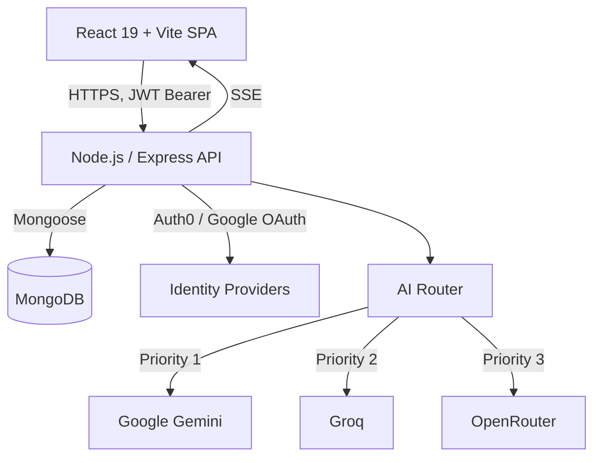

<div align="center">
  <h1>🚀 CourseAI Pro</h1>
  <p><strong>An AI-powered talent upskilling platform that bridges skill gaps by generating full, structured courses on any topic in seconds, then teaches them back through streaming lessons, adaptive quizzes, and AI-scored mock interviews.</strong></p>

  <p>
    <a href="https://smart-course-generator.vercel.app/"></a>
    <a href="https://github.com/rahulpaul-07/smart-course-generator/actions/workflows/ci.yml"></a>
    <a href="https://github.com/rahulpaul-07/smart-course-generator/actions/workflows/codeql.yml"></a>
    <a href="./frontend/tsconfig.app.json"></a>
    <a href="./backend/package.json"></a>
    <a href="./LICENSE"></a>
  </p>

  <p>
    <b><a href="https://smart-course-generator.vercel.app/">Try the Live Demo →</a></b><br/>
    <i>(Backend runs on Render's free tier; the first request after inactivity may take 30-60s to cold-start, but it's blazingly fast after that!)</i>
  </p>
</div>

---

## 📑 Table of Contents
- [✨ Overview](#-overview)
- [🎯 Why CourseAI Pro?](#-why-courseai-pro)
- [🔥 Key Features](#-key-features)
- [🏗️ Architecture](#️-architecture)
- [🛠️ Tech Stack](#️-tech-stack)
- [🚀 Getting Started](#-getting-started)
- [🧪 Testing](#-testing)
- [🌐 Deployment](#-deployment)
- [🔒 Security](#-security)
- [📚 Documentation](#-documentation)

---

## ✨ Overview

Static course platforms (Udemy, Coursera) can't adapt to what an individual learner already knows. General-purpose chat assistants (like ChatGPT) can generate content, but they produce a linear conversation—not a structured, resumable curriculum with progress tracking, spaced-repetition review, and assessments.

**CourseAI Pro bridges the gap as an AI-powered talent upskilling platform:** Designed to address workforce skill gaps, it leverages AI to generate full multi-module courses—streamed lesson-by-lesson over Server-Sent Events (SSE). It acts as an adaptive learning engine featuring quizzes, flashcards, and optional YouTube video enrichment per lesson.

Aligned with the principles of Talent Intelligence and skills-based learning, progress, XP, and streaks are tracked per user. Courses can be published to a community marketplace, and a dedicated **Interview Prep** mode acts as an AI screening tool by running mock technical interviews (MCQ, theory, and coding rounds) with detailed strengths and weaknesses feedback.

## 🎯 Why CourseAI Pro?

- ⚡ **Real-time Streaming Engine:** Unlike traditional AI wrappers, CourseAI streams robust curricula in real-time. No more waiting minutes for generation.
- 🛡️ **Resilient AI Routing:** A custom router fails over across three LLM providers with retry-with-backoff, per-provider circuit breakers, and API-key rotation, so a single provider rate-limiting or timing out degrades gracefully instead of failing the request.
- 🎥 **Engaging Pedagogy:** Curated YouTube videos interleave seamlessly within generated text content to maximize retention and engagement.
- 🎨 **Premium UI/UX:** Built with Tailwind CSS and Radix UI for an accessible, buttery-smooth, and strictly typed user experience.

## 🔥 Key Features

| Feature | Description |
|---|---|
| **🧠 AI Course Generation** | A topic in, a structured course out: modules, lessons, and a final assessment, streamed incrementally so the UI never blocks. |
| **🔀 Multi-Provider AI Routing** | A custom router fails over across Gemini, Groq, and OpenRouter, with per-provider API key rotation and cooldown handling. |
| **📖 Adaptive Study Tools** | AI-generated flashcards, practice labs, inline lesson chat, and optional **Hinglish audio explanations** via text-to-speech. |
| **💼 Interview Prep Mode** | Generates MCQ, theory, and coding question sets for a topic, scores submitted answers, and produces a strengths/weaknesses breakdown. |
| **🗺️ Learning Roadmaps** | Multi-week personalized learning plans generated from a goal, duration, and skill level. |
| **🎮 Gamification** | Track XP, streaks, and achievements on a public leaderboard. Publish courses publicly and clone others' courses. |
| **🎓 Verifiable Certificates** | PDF certificates generated on course completion, independently verifiable via a public certificate ID. |
| **🔐 Enterprise-grade Auth** | Email/password, Google OAuth, or Auth0, all normalized behind the same secure session contract on the frontend. |

## 🏗️ Architecture



The frontend and backend are independently deployable: a React SPA (Vite, TypeScript, Tailwind, React Query) talking to a stateless Express API over a versioned REST contract, secured with JWTs so either side can scale or redeploy on its own. 

> 💡 See [`docs/architecture/`](./docs/architecture) for per-layer diagrams (frontend, backend, auth, database, AI routing) and [`docs/engineering_decisions.md`](./docs/engineering_decisions.md) for the reasoning behind notable choices (e.g., custom AI router over LangChain, SSE over WebSockets, stateless JWT auth).

## 🛠️ Tech Stack

### Frontend
<p>
  
  
  
  
</p>

### Backend & DB
<p>
  
  
  
</p>

### AI Providers
<p>
  
  
  
</p>

## 🚀 Getting Started

**Prerequisites:** Node.js 18+, npm, and a MongoDB instance (local or [Atlas](https://www.mongodb.com/atlas)).

```bash
git clone https://github.com/rahulpaul-07/smart-course-generator.git
cd smart-course-generator

# 1. Setup Backend
cd backend
npm install
cp .env.example .env   # fill in MONGO_URI, JWT_SECRET, and at least one AI provider key
npm run dev             # http://localhost:8000

# 2. Setup Frontend (in a separate terminal)
cd frontend
npm install
cp .env.example .env
npm run dev             # http://localhost:5173
```

> 📚 With the backend running, interactive API docs (Swagger) are available at `http://localhost:8000/api-docs`.

## 🧪 Testing

```bash
cd backend && npm test    # Jest + Supertest, against an in-memory MongoDB instance
cd frontend && npm test   # Vitest + React Testing Library
```

`npm run typecheck` in `frontend/` runs a full `tsc -b` project build across the app and Vite config; `npm run lint` runs ESLint in both packages. All four gates run in CI on every push and pull request to `main`.

## 🌐 Deployment

The repo is preconfigured for a split Vercel/Render deployment.

- **Backend (Render):** root directory `backend`, build `npm install`, start `npm start`. Set `MONGO_URI`, `JWT_SECRET`, and your AI provider keys as environment variables. See [`render.yaml`](./render.yaml).
- **Frontend (Vercel):** root directory `frontend`, framework preset Vite. Set `VITE_API_BASE_URL` to the deployed backend URL. `vercel.json` already handles SPA routing.

## 🧪 AI Quality, Grounding & Evals

Because "AI wrapper" projects are only as trustworthy as their output, generation quality is **measured**, not assumed:

- **Eval harness** ([`evals/`](./evals)) scores generated courses on structural validity, subtopic coverage, and — with AI keys — an LLM-as-judge **faithfulness** rating. It runs in CI on every push (mock mode, no keys) as a regression smoke test, and as a real quality gate when keys are present. Run locally: `npm run eval` (from `backend/`). Latest scorecard: [`evals/report.md`](./evals/report.md).
- **RAG grounding** ([`backend/services/retrieval/`](./backend/services/retrieval)) retrieves vetted source excerpts from a curated corpus and injects them into lesson prompts so content stays factual and citeable. Pluggable vector store (in-memory today, Atlas Vector Search ready). Off by default; enable with `RAG_ENABLED=true`. Measure the faithfulness lift by running the evals with grounding on vs. off.
- **Provider resilience** ([`backend/services/aiRouter.js`](./backend/services/aiRouter.js)) — retry-with-backoff, per-provider circuit breaker, and telemetry, all covered by unit tests in [`backend/tests/aiRouter.test.js`](./backend/tests/aiRouter.test.js).

## ⚠️ Known Limitations & Roadmap

Honest scope, because tradeoffs matter more than superlatives:

- **Auth** now uses short-lived access tokens (default 30m) + **rotating, revocable httpOnly refresh tokens** with reuse detection (`backend/services/tokenService.js`), and a transparent 401-refresh interceptor on the client. Remaining hardening (moving the access token fully into memory) is tracked in [`docs/adr/0001-auth-token-model.md`](./docs/adr/0001-auth-token-model.md).
- **RAG corpus is intentionally small** (a demonstrator set); production use would expand it and move the store to Atlas Vector Search.
- **Coverage thresholds** are a conservative floor; they are ratcheted up as tests grow, never down.

## 🔒 Security

- Helmet security headers, MongoDB query sanitization, and XSS input sanitization on every request.
- Global and endpoint-specific rate limiting, including a dedicated auth limiter to slow down credential-stuffing attempts.
- Passwords hashed with bcrypt and never returned in API responses; JWT secret is required at boot (the process refuses to start without one).
- Zod schema validation on all mutating routes; ObjectId shape validation on all `:id`-style route params.

## 📚 Documentation

Detailed documentation is available in the [`docs/`](./docs) folder:

| Document | Description |
|---|---|
| [`docs/architecture/`](./docs/architecture/) | High-level system topology, frontend/backend architecture, and auth flows. |
| [`docs/api/api-diagram.md`](./docs/api/api-diagram.md) | API route map, public vs. protected access. |
| [`docs/database/er-diagram.md`](./docs/database/er-diagram.md) | Full entity-relationship diagram with indexes. |
| [`docs/deployment.md`](./docs/deployment.md) | Production deployment guide (Vercel, Render, MongoDB Atlas). |
| [`docs/engineering_decisions.md`](./docs/engineering_decisions.md) | Rationale behind key technical choices. |
| [`docs/adr/`](./docs/adr/) | Architecture Decision Records (e.g., auth token model). |

## 🤝 Contributing

Contributions are welcome — see [`CONTRIBUTING.md`](./CONTRIBUTING.md) for the workflow and [`CODE_OF_CONDUCT.md`](./CODE_OF_CONDUCT.md). Check [`CHANGELOG.md`](./CHANGELOG.md) for release history.

## 📜 License

MIT — see [`LICENSE`](./LICENSE).
