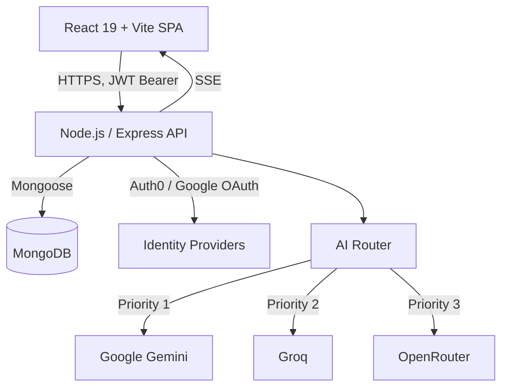

# Smart Course Generator

An AI-powered adaptive learning platform. Give it any topic and it generates a full, structured course — modules, lessons, and a final assessment — streamed lesson-by-lesson, then teaches it back through quizzes, flashcards, and AI-scored mock interviews.

<p>
  <a href="https://smart-course-generator.vercel.app/"></a>
  <a href="https://github.com/rahulpaul-07/smart-course-generator/actions/workflows/ci.yml"></a>
  <a href="https://github.com/rahulpaul-07/smart-course-generator/actions/workflows/codeql.yml"></a>
  <a href="./frontend/tsconfig.app.json"></a>
  <a href="./LICENSE"></a>
</p>

**[Try the live demo](https://smart-course-generator.vercel.app/)** — the backend runs on Render's free tier, so the first request after a period of inactivity cold-starts in ~30-60s.

---

## Table of Contents

- [Overview](#overview)
- [What Makes It Different](#what-makes-it-different)
- [Key Features](#key-features)
- [Architecture](#architecture)
- [Tech Stack](#tech-stack)
- [Getting Started](#getting-started)
- [Testing](#testing)
- [AI Quality, Grounding & Evals](#ai-quality-grounding--evals)
- [Known Limitations & Roadmap](#known-limitations--roadmap)
- [Deployment](#deployment)
- [Security](#security)
- [Documentation](#documentation)

---

## Overview

Static course platforms can't adapt to what an individual learner already knows, and a general-purpose chat assistant produces a linear conversation, not a structured, resumable curriculum with progress tracking, spaced-repetition review, and assessments.

Smart Course Generator sits in that gap. It generates full multi-module courses with an LLM, streams them lesson-by-lesson over Server-Sent Events (SSE), and layers on quizzes, flashcards, optional YouTube enrichment, per-user progress/XP/streaks, a community marketplace, and an Interview Prep mode that runs mock technical interviews (MCQ, theory, and coding rounds) with a strengths-and-weaknesses breakdown.

The emphasis is on the parts that make an "AI wrapper" actually trustworthy and production-shaped: a resilient multi-provider AI layer, measured generation quality (evals), retrieval grounding, and real auth/security — not just a prompt and a UI.

## What Makes It Different

- **Real-time streaming generation.** Courses stream in over SSE so the UI renders lesson-by-lesson instead of blocking on a single long completion.
- **Resilient AI routing.** A custom router fails over across three LLM providers with retry-with-backoff, per-provider circuit breakers, and API-key rotation, so a single provider rate-limiting or timing out degrades gracefully instead of failing the request.
- **Measured, not assumed, quality.** Generation is scored by an eval harness (structural validity, subtopic coverage, and an LLM-as-judge faithfulness rating) that runs in CI.
- **Grounded content.** Optional RAG retrieval injects vetted source excerpts into lesson prompts to keep content factual and citeable.

## Key Features

| Feature | Description |
|---|---|
| **AI course generation** | A topic in, a structured course out: modules, lessons, and a final assessment, streamed incrementally so the UI never blocks. |
| **Multi-provider AI routing** | A custom router fails over across Gemini, Groq, and OpenRouter, with per-provider API-key rotation and cooldown handling. |
| **Adaptive study tools** | AI-generated flashcards, practice labs, inline lesson chat, and optional Hinglish audio explanations via text-to-speech. |
| **Interview Prep mode** | Generates MCQ, theory, and coding question sets for a topic, scores submitted answers, and produces a strengths/weaknesses breakdown. |
| **Learning roadmaps** | Multi-week personalized learning plans generated from a goal, duration, and skill level. |
| **Gamification** | XP, streaks, and achievements on a public leaderboard; publish courses publicly and clone others'. |
| **Verifiable certificates** | PDF certificates on course completion, independently verifiable via a public certificate ID. |
| **Flexible auth** | Email/password, Google OAuth, or Auth0, all normalized behind one session contract on the frontend. |

## Architecture



The frontend and backend are independently deployable: a React SPA (Vite, TypeScript, Tailwind, React Query) talking to a stateless Express API over a versioned REST contract, secured with JWTs so either side can scale or redeploy on its own.

See [`docs/architecture/`](./docs/architecture) for per-layer diagrams (frontend, backend, auth, database, AI routing) and [`docs/engineering_decisions.md`](./docs/engineering_decisions.md) for the reasoning behind notable choices (custom AI router over LangChain, SSE over WebSockets, stateless JWT auth).

## Tech Stack

- **Frontend:** React 19, TypeScript (strict), Vite, Tailwind CSS, Radix UI, React Query
- **Backend:** Node.js (>=20), Express, MongoDB / Mongoose
- **AI providers:** Google Gemini, Groq, OpenRouter (behind a custom failover router)
- **Tooling:** Jest + Supertest, Vitest + React Testing Library, Playwright (E2E), ESLint, GitHub Actions CI + CodeQL

## Getting Started

**Prerequisites:** Node.js 18+, npm, and a MongoDB instance (local or [Atlas](https://www.mongodb.com/atlas)).

```bash
git clone https://github.com/rahulpaul-07/smart-course-generator.git
cd smart-course-generator

# 1. Backend
cd backend
npm install
cp .env.example .env    # fill in MONGO_URI, JWT_SECRET, and at least one AI provider key
npm run dev             # http://localhost:8000

# 2. Frontend (separate terminal)
cd frontend
npm install
cp .env.example .env
npm run dev             # http://localhost:5173
```

With the backend running, interactive API docs (Swagger) are available at `http://localhost:8000/api-docs`.

## Testing

```bash
cd backend && npm test    # Jest + Supertest, against an in-memory MongoDB instance
cd frontend && npm test   # Vitest + React Testing Library
```

`npm run typecheck` in `frontend/` runs a full `tsc -b` build across the app and Vite config; `npm run lint` runs ESLint in both packages. All four gates run in CI on every push and pull request to `main`.

## AI Quality, Grounding & Evals

An "AI wrapper" is only as trustworthy as its output, so generation quality is measured, not assumed:

- **Eval harness** ([`evals/`](./evals)) scores generated courses on structural validity, subtopic coverage, and — with AI keys — an LLM-as-judge faithfulness rating. It runs in CI on every push as a structural-contract smoke test (mock mode, no keys), and as a real quality gate when keys are present. Run locally: `npm run eval` (from `backend/`). Latest scorecard: [`evals/report.md`](./evals/report.md).
- **RAG grounding** ([`backend/services/retrieval/`](./backend/services/retrieval)) retrieves vetted source excerpts from a curated corpus and injects them into lesson prompts so content stays factual and citeable. Pluggable vector store (in-memory today, Atlas Vector Search ready). Off by default; enable with `RAG_ENABLED=true`. Measure the faithfulness lift by running the evals with grounding on vs. off.
- **Provider resilience** ([`backend/services/aiRouter.js`](./backend/services/aiRouter.js)) — retry-with-backoff, per-provider circuit breaker, and telemetry, all covered by unit tests in [`backend/tests/aiRouter.test.js`](./backend/tests/aiRouter.test.js).

## Known Limitations & Roadmap

Honest scope, because tradeoffs matter more than superlatives:

- **Auth** uses short-lived access tokens (default 30m) plus rotating, revocable httpOnly refresh tokens with reuse detection ([`backend/services/tokenService.js`](./backend/services/tokenService.js)), and a transparent 401-refresh interceptor on the client. Remaining hardening (moving the access token fully into memory) is tracked in [`docs/adr/0001-auth-token-model.md`](./docs/adr/0001-auth-token-model.md).
- **RAG corpus is intentionally small** (a demonstrator set); production use would expand it and move the store to Atlas Vector Search.
- **Test coverage** is collected and reported in CI. A numeric coverage gate is intentionally deferred until a baseline is measured, then set slightly below the observed number to catch regressions without blocking on legacy untested modules.

## Deployment

Preconfigured for a split Vercel/Render deployment.

- **Backend (Render):** root directory `backend`, build `npm install`, start `npm start`. Set `MONGO_URI`, `JWT_SECRET`, and your AI provider keys as environment variables. See [`render.yaml`](./render.yaml).
- **Frontend (Vercel):** root directory `frontend`, framework preset Vite. Set `VITE_API_BASE_URL` to the deployed backend URL; `vercel.json` handles SPA routing.

## Security

- Helmet security headers, MongoDB query sanitization, and XSS input sanitization on every request.
- Global and endpoint-specific rate limiting, including a dedicated auth limiter to slow credential-stuffing attempts.
- Passwords hashed with bcrypt and never returned in API responses; the JWT secret is required at boot (the process refuses to start without one).
- Zod schema validation on all mutating routes; ObjectId shape validation on all `:id`-style route params.

See [`SECURITY.md`](./SECURITY.md) for the vulnerability-reporting policy.

## Documentation

Detailed documentation lives in [`docs/`](./docs):

| Document | Description |
|---|---|
| [`docs/architecture/`](./docs/architecture/) | System topology, frontend/backend architecture, and auth flows. |
| [`docs/api/api-diagram.md`](./docs/api/api-diagram.md) | API route map, public vs. protected access. |
| [`docs/database/er-diagram.md`](./docs/database/er-diagram.md) | Entity-relationship diagram with indexes. |
| [`docs/deployment.md`](./docs/deployment.md) | Production deployment guide (Vercel, Render, MongoDB Atlas). |
| [`docs/engineering_decisions.md`](./docs/engineering_decisions.md) | Rationale behind key technical choices. |
| [`docs/adr/`](./docs/adr/) | Architecture Decision Records. |

## Contributing

Contributions are welcome — see [`CONTRIBUTING.md`](./CONTRIBUTING.md) for the workflow and [`CODE_OF_CONDUCT.md`](./CODE_OF_CONDUCT.md). See [`CHANGELOG.md`](./CHANGELOG.md) for release history.

## License

MIT — see [`LICENSE`](./LICENSE).
