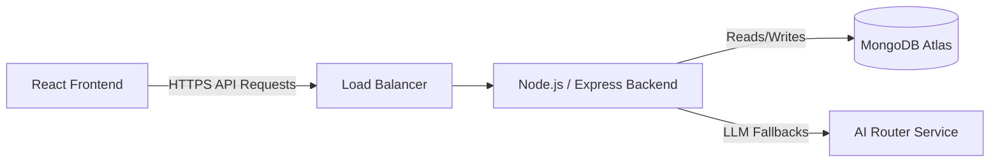

<h1 align="center">CourseAI Pro 🚀</h1>
<p align="center">
  
</p>
<p align="center">
  <em>An intelligent, scalable EdTech platform generating personalized, highly structured learning courses dynamically via advanced LLM orchestration.</em>
</p>

<p align="center">
  
</p>

---

## 🌟 Why CourseAI Pro?

Traditional learning platforms like Coursera are static. AI chatbots like ChatGPT are unstructured and prone to hallucination. **CourseAI Pro** bridges the gap. It utilizes a custom AI routing architecture to dynamically stream interactive, hyper-tailored technical courses while providing a robust, gamified interface (XP, leaderboards, quizzes) to track progress.

## ✨ Core Features

| Feature | Description | Technical Implementation |
|---------|-------------|--------------------------|
| **Instant Generation** | 2,000+ word structured courses generated in seconds. | Gemini LLM + Custom Fallback Router |
| **Real-time Streaming** | No loading spinners. Content appears chunk-by-chunk. | Node.js Server-Sent Events (SSE) |
| **Gamified Ecosystem** | Earn XP, track streaks, and climb weekly leaderboards. | MongoDB Aggregation Pipelines |
| **Community Market** | Publish your courses or clone top-rated community courses. | Express.js + React.js |
| **Interactive Tutors** | Ask questions directly in the context of a lesson. | Bounded Context Prompts |

---

## 🏗️ Architecture

CourseAI Pro is designed with **Production Engineering** standards. It is resilient, secure, and performant.

### Highlights:
- **Resilient AI Routing:** Graceful degradation fallback from Gemini → OpenRouter → Groq ensures 99.9% generation uptime.
- **Security Posture:** Endpoints fortified with `zod` schema validation, `helmet` HTTP headers, and NoSQL injection sanitization.
- **Performance:** Heavy read endpoints (like Community Leaderboards) are protected by `node-cache` memory caching.

### System Diagram

👉 *[Read the Full Technical Deep Dive](./docs/portfolio/technical-deep-dive.md)* | *[View all Architecture Diagrams](./docs/architecture/)*

---

## 📸 Screenshots

| Dashboard & Leaderboard | Course Streamer & AI Tutor |
|:-----------------------:|:--------------------------:|
| *[View Analytics](./docs/assets/dashboard-placeholder.png)* | *[View Lesson](./docs/assets/lesson-placeholder.png)* |

---

## 🚀 Quick Start

### 1. Local Setup
Ensure you have Node.js 18+ and MongoDB running.
```bash
git clone https://github.com/yourusername/smart-course-generator.git
cd smart-course-generator/backend
npm install
```

### 2. Environment Configuration
Copy the `.env.example` file to `.env` and provide your keys:
```bash
cp .env.example .env
```
*Required: `MONGO_URI`, `JWT_SECRET`, `GEMINI_API_KEY`*

### 3. Run the Backend
```bash
npm run dev
```
Navigate to `http://localhost:8000/api-docs` to view the interactive **Swagger API Documentation**.

---

## 🚢 Production Deployment

CourseAI Pro is fully configured for seamless deployment across modern cloud platforms. The repository includes configurations for **Vercel**, **Render**, and **Docker**.

### Method 1: Vercel (Frontend) & Render (Backend)
This is the recommended approach for the best performance and easiest CI/CD.

**1. Deploy Backend (Render)**
- Connect the repository to Render and create a new **Web Service**.
- **Root Directory**: `backend`
- **Build Command**: `npm install`
- **Start Command**: `npm start`
- Add necessary environment variables (`MONGO_URI`, `GEMINI_API_KEY`, etc.).
- Copy the generated Render URL (e.g., `https://courseai-backend.onrender.com`).

**2. Deploy Frontend (Vercel)**
- Connect the repository to Vercel and create a new Project.
- **Root Directory**: `frontend`
- **Framework Preset**: Vite
- **Environment Variables**: Add `VITE_API_BASE_URL` and set it to your Render URL. Our dynamic API resolver will automatically append `/api` to it.
- Vercel automatically detects the `vercel.json` file for SPA routing.

### Method 2: Docker Compose (All-in-one)
For dedicated servers or VPS, use the included Docker configuration:
```bash
# Rename environment files
cp backend/.env.example backend/.env
cp frontend/.env.example frontend/.env

# Build and start the cluster
docker-compose up -d --build
```

### Health Probes
Deployment pipelines and orchestrators can utilize the built-in probes:
- **Readiness**: `/api/health/readiness`
- **Liveness**: `/api/health/liveness`

👉 *[See Full Deployment Verification](./docs/deployment-verification.md)*

---

## 🧪 Testing & CI/CD Pipeline

The repository uses **Jest** and **Supertest** for isolated integration testing, heavily utilizing `mongodb-memory-server` to mock DB connections cleanly.
```bash
cd backend
npm run test
```

### Continuous Integration (GitHub Actions)
CourseAI Pro implements a production-grade CI pipeline (`.github/workflows/ci.yml`) that runs on every `push` and `pull_request` to `main`.
The pipeline ensures code quality by automating:
- **Frontend**: Dependency installation (with npm caching), ESLint checks, TypeScript type checking (`npx tsc --noEmit`), and production build verification (`npm run build`).
- **Backend**: Dependency installation and ESLint checks.

Builds will automatically **fail** if there are syntax errors, missing dependencies, TypeScript type errors, or failed linting rules.

---

## 📚 Recruiter & Portfolio Assets

Hiring managers and recruiters can explore the following artifacts to understand the depth of engineering applied to this project:
- 📖 [10-Minute Technical Walkthrough](./docs/demo/recruiter-walkthrough.md)
- ❓ [Recruiter FAQ](./docs/demo/recruiter-faq.md)
- 📊 [Competitive Benchmark Report](./docs/benchmark-report.md)
- 💬 [Interview Discussion Guide (STAR Format)](./docs/portfolio/interview-discussion-guide.md)

---
<p align="center">Made with ❤️ by an engineer passionate about scaling AI applications.</p>
