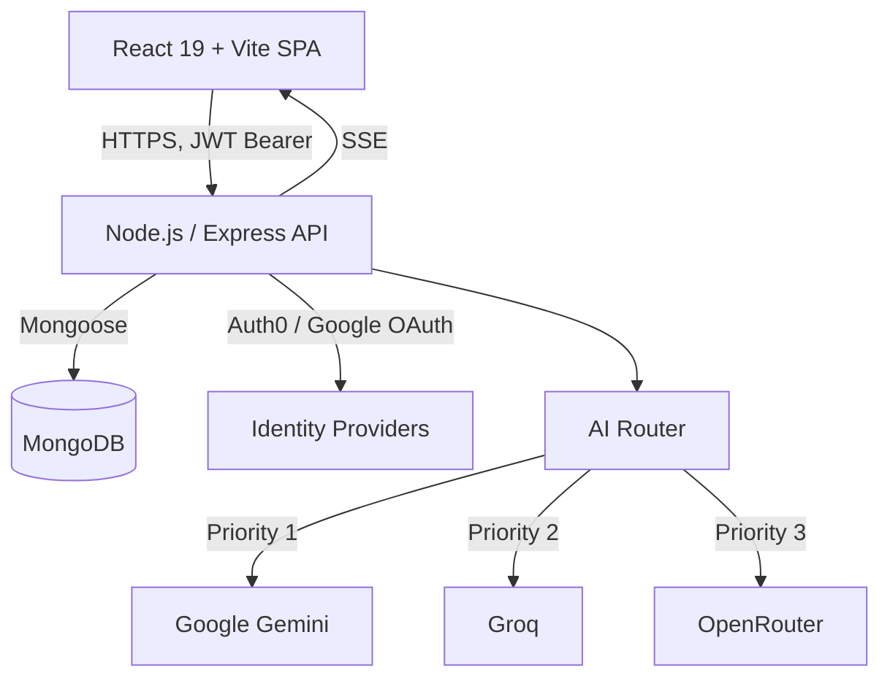

# CourseAI Pro

An AI-powered learning platform that generates full, structured courses on any topic in seconds, then teaches them back through streaming lessons, adaptive quizzes, flashcards, mock interviews, and a public leaderboard.

[](https://smart-course-generator.vercel.app/)
[](https://github.com/rahulpaul-07/smart-course-generator/actions/workflows/ci.yml)
[](./LICENSE)
[](./backend/package.json)
[](./frontend/tsconfig.app.json)

**[Live demo →](https://smart-course-generator.vercel.app/)** — backend runs on Render's free tier, so the first request after a period of inactivity can take 30-60s to cold-start; it's fast after that.

## Table of Contents
- [Overview](#overview)
- [Why CourseAI Pro?](#why-courseai-pro)
- [Screenshots](#screenshots)
- [Features](#features)
- [Architecture](#architecture)
- [Tech stack](#tech-stack)
- [Getting started](#getting-started)
- [Testing](#testing)
- [Deployment](#deployment)
- [Security](#security)
- [Documentation](#documentation)

## Overview

Static course platforms (Udemy, Coursera) can't adapt to what an individual learner already knows. General-purpose chat assistants can generate content, but produce a linear conversation, not a structured, resumable curriculum with progress tracking, spaced-repetition review, and assessment.

CourseAI Pro sits between the two: give it a topic, and it generates a full multi-module course — streamed lesson-by-lesson over Server-Sent Events rather than a single blocking request — with quizzes, flashcards, and optional YouTube video enrichment per lesson. Progress, XP, and streaks are tracked per user, courses can be published to a community marketplace, and a separate interview-prep mode runs mock technical interviews (MCQ, theory, and coding rounds) with AI-scored feedback.

## Why CourseAI Pro?

- **Real-time Streaming Engine:** Unlike traditional AI wrappers, CourseAI streams robust curricula in real-time. No waiting minutes for generation.
- **Resilient AI Routing:** Built-in multi-provider failover guarantees uptime. If Gemini rate-limits, Groq takes over seamlessly.
- **Engaging Pedagogy:** Videos interleave seamlessly within generated content to maximize retention and engagement.

## Screenshots

*(Screenshots coming soon - Add your images here!)*
<!--


-->

## Features

- **AI course generation** — a topic in, a structured course out: modules, lessons, and a final assessment, streamed incrementally so the UI never blocks on a single long request.
- **Multi-provider AI routing** — a custom router (no LangChain) fails over across Gemini, Groq, and OpenRouter, with per-provider API key rotation and cooldown handling, so a single rate-limited key doesn't take generation down.
- **Adaptive study tools** — AI-generated flashcards, practice labs, and inline lesson chat, plus optional Hinglish audio explanations via text-to-speech.
- **Interview prep** — generates MCQ, theory, and coding question sets for a topic, scores submitted answers, and produces a strengths/weaknesses breakdown.
- **Roadmaps** — multi-week personalized learning plans generated from a goal, duration, and skill level.
- **Community & gamification** — publish courses publicly, clone others', rate and upvote templates, and track XP, streaks, and achievements on a public leaderboard.
- **Certificates** — PDF certificates generated on course completion, independently verifiable via a public certificate ID.
- **Auth** — email/password, Google OAuth, or Auth0, behind the same session contract on the frontend.

## Architecture



The frontend and backend are independently deployable: a React SPA (Vite, TypeScript, Tailwind, React Query) talking to a stateless Express API over a versioned REST contract, secured with JWTs so either side can scale or redeploy on its own. See [`docs/architecture/`](./docs/architecture) for the per-layer diagrams (frontend, backend, auth, database, AI routing) and [`docs/engineering_decisions.md`](./docs/engineering_decisions.md) for the reasoning behind the notable choices (custom AI router over LangChain, SSE over WebSockets, stateless JWT auth, Tailwind over a component library).

## Tech stack

| Layer | Technologies |
|---|---|
| Frontend | React 19, TypeScript, Vite, Tailwind CSS, React Query, React Router, Radix UI |
| Backend | Node.js, Express, MongoDB (Mongoose), Zod validation |
| AI | Google Gemini, Groq, OpenRouter — routed with automatic fallback |
| Auth | JWT (email/password), Google OAuth, Auth0 |
| Testing | Jest + Supertest (backend), Vitest + Testing Library (frontend) |
| Tooling | ESLint, TypeScript project references, GitHub Actions CI |

## Getting started

**Prerequisites:** Node.js 18+, npm, and a MongoDB instance (local or [Atlas](https://www.mongodb.com/atlas)).

```bash
git clone https://github.com/rahulpaul-07/smart-course-generator.git
cd smart-course-generator

# Backend
cd backend
npm install
cp .env.example .env   # fill in MONGO_URI, JWT_SECRET, and at least one AI provider key
npm run dev             # http://localhost:8000

# Frontend, in a separate terminal
cd frontend
npm install
cp .env.example .env
npm run dev             # http://localhost:5173
```

With the backend running, interactive API docs (Swagger) are available at `http://localhost:8000/api-docs`.

Only `MONGO_URI` and `JWT_SECRET` are strictly required to boot; course generation additionally needs at least one of `GEMINI_API_KEY`, `GROQ_API_KEY`, or `OPENROUTER_API_KEY`. Google sign-in and Auth0 are both optional — the app falls back to email/password auth when their env vars are absent. See [`backend/.env.example`](./backend/.env.example) and [`frontend/.env.example`](./frontend/.env.example) for the full list.

## Testing

```bash
cd backend && npm test    # Jest + Supertest, against an in-memory MongoDB instance
cd frontend && npm test   # Vitest + React Testing Library
```

`npm run typecheck` in `frontend/` runs a full `tsc -b` project build across the app and Vite config; `npm run lint` runs ESLint in both packages. All four gates run in CI on every push and pull request to `main` (see [`.github/workflows`](./.github/workflows)).

## Deployment

The repo is preconfigured for a split Vercel/Render deployment.

**Backend (Render):** root directory `backend`, build `npm install`, start `npm start`. Set `MONGO_URI`, `JWT_SECRET`, and your AI provider keys as environment variables. See [`render.yaml`](./render.yaml).

**Frontend (Vercel):** root directory `frontend`, framework preset Vite. Set `VITE_API_BASE_URL` to the deployed backend URL — the frontend automatically appends `/api` if it's missing. `vercel.json` already handles SPA routing.

Health probes for orchestrators: `GET /api/health/liveness` and `GET /api/health/readiness`.

## Security

- Helmet security headers, MongoDB query sanitization, and XSS input sanitization on every request.
- Global and endpoint-specific rate limiting, including a dedicated auth limiter to slow down credential-stuffing attempts.
- Passwords hashed with bcrypt and never returned in API responses; JWT secret is required at boot (the process refuses to start without one).
- Zod schema validation on all mutating routes; ObjectId shape validation on all `:id`-style route params.
- See [`SECURITY.md`](./SECURITY.md) for the vulnerability disclosure policy.

## Project structure

```
backend/    Express API — controllers, routes, Mongoose models, AI services, Jest tests
frontend/   React SPA — pages, components, hooks, typed API service layer
docs/       Architecture diagrams, database schema, API flows, engineering decisions
```

## Documentation

| Doc | Covers |
|---|---|
| [`docs/architecture/architecture-diagram.md`](./docs/architecture/architecture-diagram.md) | End-to-end system architecture (client, API, AI router, database) |
| [`docs/architecture/system.md`](./docs/architecture/system.md) | High-level deployment topology |
| [`docs/architecture/backend.md`](./docs/architecture/backend.md) | Express middleware pipeline, request/response conventions, troubleshooting |
| [`docs/architecture/frontend.md`](./docs/architecture/frontend.md) | React SPA structure and routing |
| [`docs/architecture/auth.md`](./docs/architecture/auth.md) | Authentication flow (email/password, Google OAuth, Auth0) |
| [`docs/architecture/ai.md`](./docs/architecture/ai.md) | AI course/lesson generation flow |
| [`docs/architecture/database.md`](./docs/architecture/database.md) | Core schema overview |
| [`docs/database/er-diagram.md`](./docs/database/er-diagram.md) | Full entity-relationship diagram with indexes |
| [`docs/api/api-diagram.md`](./docs/api/api-diagram.md) | API route map, public vs. protected access |
| [`docs/flows/user-flow-diagram.md`](./docs/flows/user-flow-diagram.md) | End-to-end user journey |
| [`docs/flows/sequence-course-generation.md`](./docs/flows/sequence-course-generation.md) | Course generation sequence diagram |
| [`docs/deployment.md`](./docs/deployment.md) | Production deployment guide (Vercel, Render, MongoDB Atlas) |
| [`docs/engineering_decisions.md`](./docs/engineering_decisions.md) | Rationale behind key technical choices |
| [`docs/testing/e2e-verification.md`](./docs/testing/e2e-verification.md) | Automated test coverage and CI gates |

## Contributing

Contributions are welcome — see [`CONTRIBUTING.md`](./CONTRIBUTING.md) for the workflow and [`CODE_OF_CONDUCT.md`](./CODE_OF_CONDUCT.md). Check [`CHANGELOG.md`](./CHANGELOG.md) for release history.

## License

MIT — see [`LICENSE`](./LICENSE).
