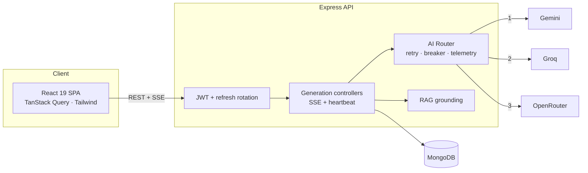

<div align="center">


# CourseAI — Smart Course Generator

**Turn one sentence into a structured course, streamed lesson by lesson, then learn it properly with quizzes, flashcards, a per-lesson tutor and scored mock interviews.**

<a href="https://smart-course-generator.vercel.app/"></a>
<a href="https://github.com/rahulpaul-07/smart-course-generator/actions/workflows/ci.yml"></a>
<a href="https://github.com/rahulpaul-07/smart-course-generator/actions/workflows/codeql.yml"></a>

<a href="./LICENSE"></a>

[**Live demo**](https://smart-course-generator.vercel.app/) · [Router status](https://smart-course-generator.vercel.app/status) · [Eval scorecard](https://smart-course-generator.vercel.app/evals) · [Architecture](./docs/architecture) · [Audit log](./docs/AUDIT-2026-09.md)


</div>

> **Try it in one click.** Hit *"Try the demo, no sign-up"* on the landing page for a private guest account with a sample course already in it. The API runs on Render's free tier, so the first request after idling can take ~30–60 s to wake up.

---

## Why this project

Most "AI course generator" demos are a prompt and a text box. The hard part of an AI product is everything that happens when the model is **slow, wrong or down**, and that's where most of this codebase lives:

| Problem | What CourseAI does |
|---|---|
| Long generations block the UI | Courses and lessons stream over **Server-Sent Events** block by block, with heartbeats so proxies don't cut long streams. |
| One provider goes down | A custom **AI router** fails over across Gemini → Groq → OpenRouter with retry + exponential backoff, per-provider **circuit breakers**, key rotation and telemetry. Bad prompts don't count as outages. |
| "Is the output any good?" | An **eval harness** scores structure, subtopic coverage and LLM-as-judge faithfulness and runs in CI. Results are public at `/evals`. |
| Hallucinated facts | Optional **RAG grounding** retrieves vetted excerpts into lesson prompts (pluggable vector store). |
| Real users, real auth | Short-lived JWTs + rotating httpOnly refresh tokens with **reuse detection**, verified-email-only account linking, Zod on every write. |
| Recruiters won't sign up | **Ephemeral guest accounts**: isolated per visitor, seeded with a course, purged after 24 h, and upgradable in place to a real account. |

## Features

- **Course generation.** Topic → modules → lessons → final test, in any language, streamed live.
- **Rich lessons.** Markdown, code with syntax highlighting, LaTeX math, callouts, embedded videos, PDF export, reading-progress tracking and focus mode.
- **Study toolkit.** Per-lesson quizzes, flashcards, practice labs, an in-context AI tutor (streamed) and Hinglish audio explanations.
- **Interview prep.** Generated MCQ, theory and coding rounds with a timer, AI grading and a strengths/gaps breakdown.
- **Roadmaps.** Week-by-week plans from a goal, timeframe and current level.
- **Progress & motivation.** Timezone-correct streaks, XP, achievements, a leaderboard (XP is idempotent, so it can't be farmed), analytics and verifiable certificates.
- **Community.** Publish, upvote, rate and clone courses; public profiles; shareable read-only course links.
- **Transparency pages.** Live router status (`/status`) and the eval scorecard (`/evals`) are public.

<table>
  <tr>
    <td></td>
    <td></td>
  </tr>
  <tr>
    <td></td>
    <td></td>
  </tr>
</table>

## Architecture


```mermaid
graph LR
    subgraph Client
      SPA[React 19 SPA<br/>TanStack Query · Tailwind]
    end
    subgraph API[Express API]
      Auth[JWT + refresh rotation]
      Gen[Generation controllers<br/>SSE + heartbeat]
      Router[AI Router<br/>retry · breaker · telemetry]
      RAG[RAG grounding]
    end
    SPA -- REST + SSE --> Auth --> Gen
    Gen --> RAG
    Gen --> Router
    Router -->|1| Gemini
    Router -->|2| Groq
    Router -->|3| OpenRouter
    Gen --> DB[(MongoDB)]
```

Frontend and backend deploy independently (Vercel + Render). Deeper dives: [system](./docs/architecture/system.md), [AI layer](./docs/architecture/ai.md), [auth](./docs/architecture/auth.md), [data model](./docs/database/er-diagram.md), [course generation sequence](./docs/flows/sequence-course-generation.md), and the [engineering decisions](./docs/engineering_decisions.md) (custom router vs. LangChain, SSE vs. WebSockets, token model).

## Tech stack

**Frontend** React 19, TypeScript (strict), Vite, Tailwind CSS, Radix UI, TanStack Query, Framer Motion · **Backend** Node 20, Express, MongoDB/Mongoose, Zod · **AI** Gemini, Groq, OpenRouter behind a custom router · **Quality** Jest + Supertest, Vitest + Testing Library, Playwright, ESLint, GitHub Actions, CodeQL, Dependabot

## Run it locally in two commands

No database, no API keys, no `.env` needed:

```bash
# terminal 1: API on an in-memory MongoDB, seeded with sample courses, guest mode on
cd backend && npm install && npm run dev:memory

# terminal 2: web app on http://localhost:5173
cd frontend && npm install && npm run dev
```

With no provider key, the AI router runs in a deterministic mock mode so every flow works offline. For real generation, copy `backend/.env.example` to `backend/.env` and add any of `GEMINI_API_KEY`, `GROQ_API_KEY` or `OPENROUTER_API_KEY`. Use `npm run dev` with a real `MONGO_URI` for persistent data, and `npm run seed` once to load the showcase courses guests are cloned from.

API docs (Swagger) are served at `http://localhost:8000/api-docs` in development.

## Testing

| Suite | Command | What it covers |
|---|---|---|
| API unit | `npm run test:unit` (backend) | Router failover, circuit breaker, JSON repair, streaks, XP rules, SSE heartbeat. No DB, ~2 s. |
| API integration | `npm run test:integration` | Supertest against in-memory MongoDB: auth, ownership, XP integrity, guest accounts, community. |
| UI | `npm test` (frontend) | Components, token refresh/retry, theme, pending-prompt handoff. |
| End-to-end | `npm run e2e` (frontend) | Playwright against the real API: landing, auth, guest journey through a lesson, mobile layout. |
| Evals | `npm run eval` (backend) | Generation quality scorecard; mock mode in CI, real scores with a key. |

Every gate (lint, types, all test suites, evals, build, E2E) runs in CI on each push and pull request.

## Security

Helmet headers, NoSQL-operator sanitisation, per-route rate limits (auth limits count only failed attempts), bcrypt, a required strong `JWT_SECRET` in production, ObjectId validation on every `:id` param, ownership checks on every resource, and verified-email-only linking for Google and Auth0. Findings and fixes from two full audits are written up in [`docs/AUDIT-2026-09.md`](./docs/AUDIT-2026-09.md). Report vulnerabilities per [`SECURITY.md`](./SECURITY.md).

## Deployment

- **API (Render):** root `backend`, start `npm start`. Set `MONGO_URI`, `JWT_SECRET` (32+ chars), at least one AI key, `CLIENT_URL`, and optionally `DEMO_MODE=true`. See [`render.yaml`](./render.yaml).
- **Web (Vercel):** root `frontend`, Vite preset, `VITE_API_BASE_URL` pointing at the API. `vercel.json` handles SPA routing.

Full guide: [`docs/deployment.md`](./docs/deployment.md).

## Known limitations

- The RAG corpus is a small demonstrator set; production would expand it and move to Atlas Vector Search.
- The committed eval scorecard is from mock mode; run `npm run eval` with a key to record real quality numbers.
- Password reset needs an email provider and isn't implemented; accounts can use Google or Auth0 instead.

## License

MIT © Rahul Paul. See [`CONTRIBUTING.md`](./CONTRIBUTING.md) and [`CHANGELOG.md`](./CHANGELOG.md).
