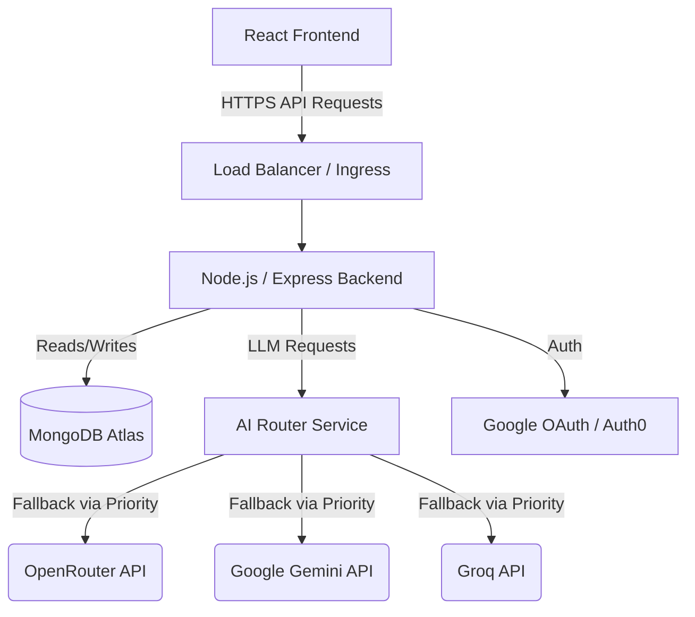
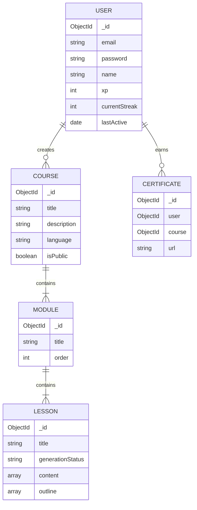

# Architecture Documentation

## System Architecture Diagram

## Database Schema Diagram

## Request Flow Documentation

1. **Client Request**: The React SPA sends an API request to the backend with an Authorization Bearer token (JWT).
2. **Rate Limiter**: The request passes through standard or endpoint-specific rate limiters (e.g. `/api/auth` vs `/api/courses/generate`).
3. **Tracing Middleware**: A unique `x-trace-id` is assigned or propagated for log correlation.
4. **Security & Sanitization**: Helmet adds headers. Body payloads are sanitized against NoSQL injection via `express-mongo-sanitize`.
5. **Validation Layer**: `zod` schema validators ensure payloads match expected formats before hitting the controller.
6. **Authentication**: If it's a protected route, `verifyAuth0Token` middleware checks the JWT.
7. **Cache Layer**: Unauthenticated Heavy Read routes check `node-cache`. If a cache hit occurs, the response is returned immediately.
8. **Controller Logic**: The controller handles the business logic, making calls to `services/` and `models/`.
9. **Error Handling**: Synchronous or async exceptions are bubbled to the centralized `errorMiddleware`.

## AI Generation Flow Documentation

The AI generation sequence employs a fallback routing system for maximum reliability:

1. **Trigger**: User requests a course outline or lesson content via `/api/courses/generate`.
2. **AI Router Strategy**: 
   - Primary: Gemini API is requested first for large-context generation.
   - Secondary: OpenRouter is used as a standard fallback for standard blocks.
   - Tertiary: Groq is used for fast, brief content.
3. **Chunking**: For lessons, generation is split into `createLessonOutline` followed by iterative `createLessonChunk` requests to manage context window limits and ensure high-quality detail.
4. **Validation**: Each AI response block is parsed and validated locally. If an invalid JSON schema is returned, the router automatically retries or fails over to the next provider.
5. **Streaming**: For real-time user feedback, `enrichLessonStream` utilizes Server-Sent Events (SSE) to stream blocks individually to the frontend.
