# API Architecture Diagram

This document presents the API design for the **Unified AI Course Platform**, mapping out the routes, access-control states, and parameters.

## API Endpoint Relationships

```mermaid
graph LR
    subgraph PublicEndpoints [Public API Routes]
        CertGet["GET /api/certificates/:certificateId<br/>(Public Verification)"]
        HinglishText["POST /api/explanations/hinglish-text<br/>(Text Translation)"]
        HinglishAudio["POST /api/explanations/hinglish-audio<br/>(Audio Explanation)"]
        Health["GET /api/health<br/>(System Health Check)"]
    end

    subgraph ProtectedEndpoints [Auth0 Protected API Routes]
        AuthReg["POST /api/auth/register<br/>(Sync/Create User)"]
        AuthLogin["POST /api/auth/login<br/>(Validate Session)"]
        
        CourseCreate["POST /api/courses/generate<br/>(Start AI Generation)"]
        CourseMine["GET /api/courses/mine<br/>(Fetch My Courses)"]
        CourseGet["GET /api/courses/:courseId<br/>(Course Structure)"]
        CourseDelete["DELETE /api/courses/:courseId<br/>(Remove Course)"]
        
        LessonOutline["POST /api/courses/.../outline<br/>(Generate Outline)"]
        LessonChunk["POST /api/courses/.../chunk<br/>(Stream Content Chunk)"]
        LessonQuiz["POST /api/courses/.../quiz<br/>(Generate Lesson Quiz)"]
        LessonProgress["PUT /api/courses/.../progress<br/>(Save Completed Lessons)"]
        
        CertClaim["POST /api/certificates/claim/:courseId<br/>(Submit Exam & Issue Cert)"]
    end

    classDef public fill:#d4edda,stroke:#28a745,stroke-width:2px;
    classDef protected fill:#f8d7da,stroke:#dc3545,stroke-width:2px;
    
    class CertGet,HinglishText,HinglishAudio,Health public;
    class AuthReg,AuthLogin,CourseCreate,CourseMine,CourseGet,CourseDelete,LessonOutline,LessonChunk,LessonQuiz,LessonProgress,CertClaim protected;
```

## API Endpoint Reference

### Authentication Routes
* `POST /api/auth/register`: Syncs a newly created Auth0 user into the local MongoDB database.
* `POST /api/auth/login`: Validates the local user session.

### Course Management Routes (Protected)
* `POST /api/courses/generate`: Spawns initial AI generation workflow for a course outline and list of modules.
* `GET /api/courses/mine`: Retrieves all courses created by the authenticated user.
* `GET /api/courses/:courseId`: Fetches full structural metadata for a course.
* `DELETE /api/courses/:courseId`: Deletes a course and all associated modules/lessons.

### Lesson Generation & Streaming Routes (Protected)
* `POST /api/courses/:courseId/lessons/:lessonId/generate/outline`: Generates outline headings for a specific lesson.
* `POST /api/courses/:courseId/lessons/:lessonId/generate/chunk`: Generates content blocks for a specific lesson chunk.
* `POST /api/courses/:courseId/lessons/:lessonId/generate/quiz`: Generates MCQ quizzes for the lesson.
* `PUT /api/courses/:courseId/lessons/:lessonId/progress`: Updates completion status and quiz scores.

### Certificate Routes
* `POST /api/certificates/claim/:courseId` (Protected): Evaluates final exam responses, creates the `Certificate` collection record, and updates the `Course` representation.
* `GET /api/certificates/:certificateId` (Public): Fetches verifiable certificate metadata to display on a public page.

### Explanations Routes (Public / Demo Mode)
* `POST /api/explanations/hinglish-text`: Translates and explains selected technical terms in Hinglish.
* `POST /api/explanations/hinglish-audio`: Synthesizes spoken audio explanation for technical blocks.

### Analytics Routes (Protected)
* `GET /api/analytics/dashboard`: Returns comprehensive learning analytics including streak, study hours, completion rates, quiz performance, weak/strong topics, and per-course progress.
* `POST /api/analytics/study-time`: Increments user's active study minutes and updates streak calendar.

### Roadmap Routes (Protected)
* `POST /api/roadmaps/generate`: Generates an AI-powered weekly learning roadmap with milestones and projects.
* `GET /api/roadmaps/mine`: Lists all roadmaps created by the authenticated user.
* `GET /api/roadmaps/:id`: Fetches detailed roadmap data including weekly breakdown.
* `DELETE /api/roadmaps/:id`: Deletes a saved roadmap.

### Interview Preparation Routes (Protected)
* `POST /api/interviews/generate`: Generates a complete interview preparation package (MCQs, theory, coding, mock questions).
* `GET /api/interviews/mine`: Lists all interview prep packs for the authenticated user.
* `GET /api/interviews/:id`: Fetches detailed interview prep data.
* `POST /api/interviews/:id/submit`: Evaluates user answers, runs AI grading, and produces a scorecard.
* `POST /api/interviews/:id/chat`: Stateful mock interview conversation with AI interviewer.
* `DELETE /api/interviews/:id`: Deletes an interview prep pack.
