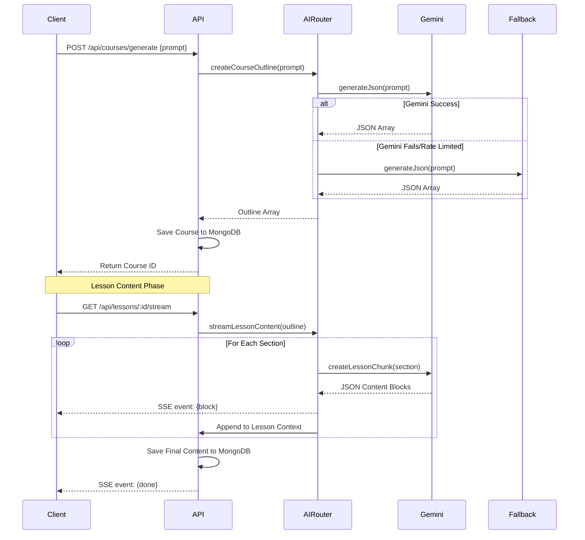

# AI Generation Flow

```mermaid
sequenceDiagram
    participant Client
    participant API
    participant AIRouter
    participant Gemini
    participant Fallback
    
    Client->>API: POST /api/courses/generate {prompt}
    API->>AIRouter: createCourseOutline(prompt)
    AIRouter->>Gemini: generateJson(prompt)
    alt Gemini Success
        Gemini-->>AIRouter: JSON Array
    else Gemini Fails/Rate Limited
        AIRouter->>Fallback: generateJson(prompt)
        Fallback-->>AIRouter: JSON Array
    end
    AIRouter-->>API: Outline Array
    API->>API: Save Course to MongoDB
    API-->>Client: Return Course ID
    
    note over Client,API: Lesson Content Phase
    
    Client->>API: GET /api/lessons/:id/stream
    API->>AIRouter: streamLessonContent(outline)
    loop For Each Section
        AIRouter->>Gemini: createLessonChunk(section)
        Gemini-->>AIRouter: JSON Content Blocks
        AIRouter-->>Client: SSE event: {block}
        AIRouter->>API: Append to Lesson Context
    end
    API->>API: Save Final Content to MongoDB
    API-->>Client: SSE event: {done}
```
