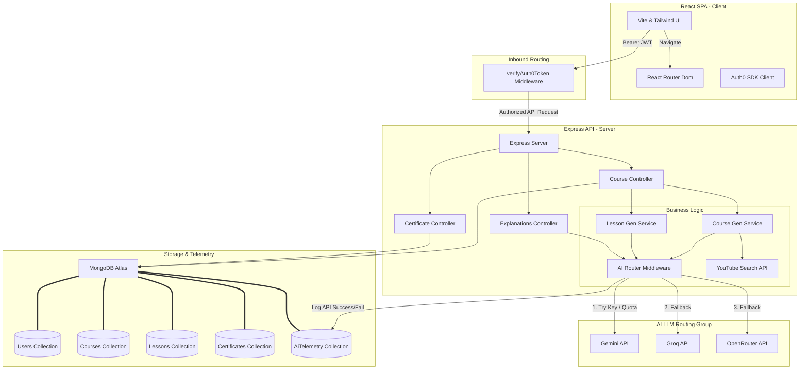

# System Architecture Diagram

This document illustrates the high-level architecture of **CourseAI Pro**, highlighting the data flow from the client application through the Express backend, the AI Router, and the persistence layer.

## System Architecture

## Architectural Components

1. **React Frontend (SPA):** Built using Vite, React, and Tailwind CSS. Authenticates users via Auth0 SDK and manages client-side routing.
2. **Express API Server:** Serves as the application gateway, performing authentication validation, exposing endpoints, and orchestrating requests.
3. **AI Router Service:** A critical failover service that routes AI requests across Gemini, Groq, and OpenRouter APIs (in that priority order) based on availability and key validation. Saves telemetry to MongoDB.
4. **MongoDB Layer:** Persists course outlines, lesson content, user records, earned certificates, and telemetry data.
