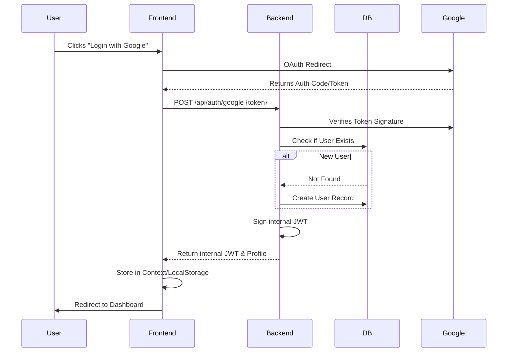

# Authentication Flow

```mermaid
sequenceDiagram
    participant User
    participant Frontend
    participant Backend
    participant DB
    
    User->>Frontend: Clicks "Login with Google"
    Frontend->>Google: OAuth Redirect
    Google-->>Frontend: Returns Auth Code/Token
    Frontend->>Backend: POST /api/auth/google {token}
    Backend->>Google: Verifies Token Signature
    Backend->>DB: Check if User Exists
    alt New User
        DB-->>Backend: Not Found
        Backend->>DB: Create User Record
    end
    Backend->>Backend: Sign internal JWT
    Backend-->>Frontend: Return internal JWT & Profile
    Frontend->>Frontend: Store in Context/LocalStorage
    Frontend->>User: Redirect to Dashboard
```
