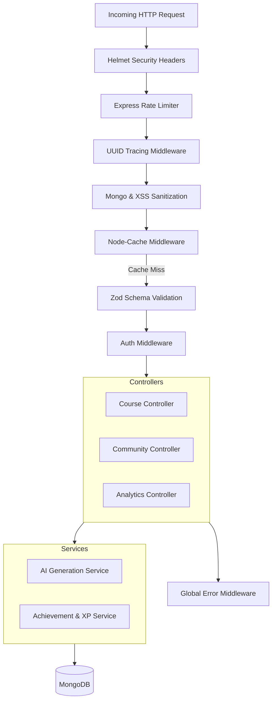

# Backend Architecture



## Request Flow

1. **Security headers:** Helmet adds standard hardening headers to every response.
2. **Rate limiting:** Requests pass through a global limiter plus endpoint-specific limiters (e.g. a stricter one on `/api/auth` and on AI generation routes).
3. **Tracing:** A unique `x-trace-id` is assigned or propagated for log correlation.
4. **Sanitization:** Request bodies/params are sanitized against NoSQL injection (`express-mongo-sanitize`) and XSS (`xss-clean`).
5. **Cache:** Cacheable, unauthenticated read routes are served from `node-cache` on a hit.
6. **Validation:** `zod` schema validation runs before the controller, rejecting malformed payloads.
7. **Auth:** Protected routes verify the JWT (issued at login, or from Auth0/Google sign-in) before reaching the controller.
8. **Controller → Service → DB:** Controllers delegate business logic to `services/`, which read/write via Mongoose models.
9. **Error handling:** Synchronous and async errors are funneled to the centralized error middleware, which returns the standard `{ success, error, traceId }` envelope.

## Response Envelope

All API responses follow a consistent shape:

```json
// Success
{ "success": true, "data": { } }

// Error
{ "success": false, "error": "Detailed error message", "traceId": "uuid-for-log-correlation" }
```

## Troubleshooting

- **`MongooseServerSelectionError` on startup:** the app's IP is not whitelisted in MongoDB Atlas Network Access, or `MONGO_URI` is wrong.
- **AI generation fails mid-request (502):** an API key in `.env` is invalid or has exceeded quota. The router falls back across Gemini → Groq → OpenRouter (see [`ai.md`](./ai.md)); providing more than one key improves uptime.
- **Jest suite times out on first run:** `mongodb-memory-server` downloads a MongoDB binary on first use; subsequent runs use the cached binary.
- **429s during local load testing:** rate limiting is endpoint-specific; see `backend/middlewares/rateLimit.js` and `backend/middlewares/aiRateLimiters.js`.
