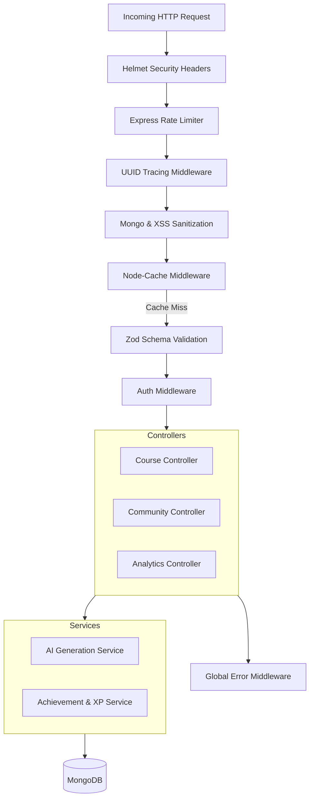

# Backend Architecture

```mermaid
graph TD
    Request[Incoming HTTP Request] --> Helmet[Helmet Security Headers]
    Helmet --> RateLimiter[Express Rate Limiter]
    RateLimiter --> Tracing[UUID Tracing Middleware]
    Tracing --> Sanitize[Mongo & XSS Sanitization]
    Sanitize --> Cache[Node-Cache Middleware]
    
    Cache -->|Cache Miss| Validation[Zod Schema Validation]
    Validation --> Auth[Auth Middleware]
    
    Auth --> Controllers
    
    subgraph Controllers
        CourseCtrl[Course Controller]
        CommunityCtrl[Community Controller]
        AnalyticsCtrl[Analytics Controller]
    end
    
    Controllers --> Services
    
    subgraph Services
        AIService[AI Generation Service]
        XP[Achievement & XP Service]
    end
    
    Services --> DB[(MongoDB)]
    Controllers --> ErrorHandler[Global Error Middleware]
```
