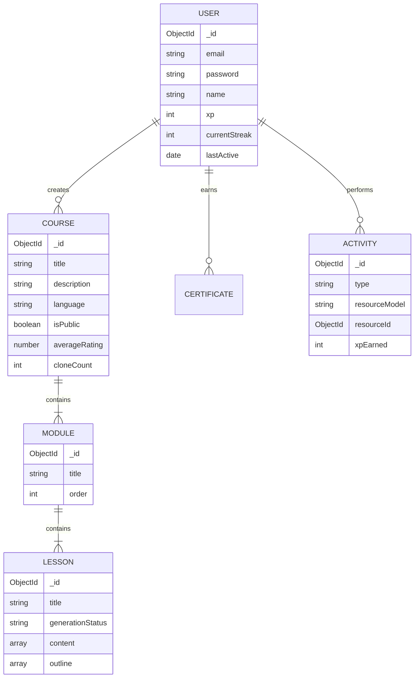

# Database Schema

```mermaid
erDiagram
    USER ||--o{ COURSE : creates
    USER ||--o{ CERTIFICATE : earns
    USER ||--o{ ACTIVITY : performs
    
    USER {
        ObjectId _id
        string email
        string password
        string name
        int xp
        int currentStreak
        date lastActive
    }
    
    COURSE ||--|{ MODULE : contains
    COURSE {
        ObjectId _id
        string title
        string description
        string language
        boolean isPublic
        number averageRating
        int cloneCount
    }
    
    MODULE ||--|{ LESSON : contains
    MODULE {
        ObjectId _id
        string title
        int order
    }
    
    LESSON {
        ObjectId _id
        string title
        string generationStatus
        array content
        array outline
    }
    
    ACTIVITY {
        ObjectId _id
        string type
        string resourceModel
        ObjectId resourceId
        int xpEarned
    }
```
