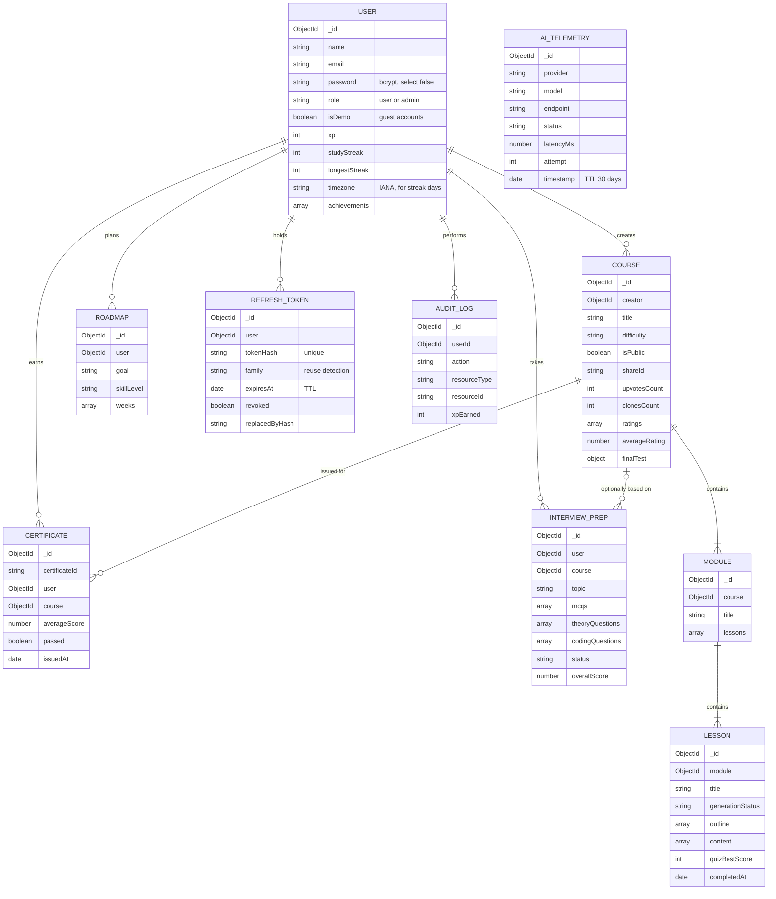

# Database Schema

MongoDB through Mongoose. Ten collections, one per model in `backend/models/`.
This page is derived from those files; if they change, update it from them.

`AI_TELEMETRY` has no foreign keys; it records one row per model call made by
the AI router.

## Indexes

| Collection | Index | Purpose |
|---|---|---|
| Course | `{ shareId: 1 }` unique, sparse | a share link resolves to exactly one course |
| Course | `{ isPublic: 1, upvotesCount: -1 }` | marketplace listing, most-upvoted first |
| Course | `{ creator: 1, createdAt: -1 }` | a user's own courses, newest first |
| Module, Lesson | `course`, `module` | walk a course top-down |
| User | `{ auth0Id: 1 }`, `{ googleId: 1 }` unique, sparse | external sign-in lookup |
| User | `isDemo` | find guest accounts |
| Certificate | `user`, `course` | a user's certificates, a course's certificates |
| RefreshToken | `tokenHash` unique; `user`; `family` | rotation and family-wide revocation |
| RefreshToken | `{ expiresAt: 1 }`, TTL 0 | expired tokens delete themselves |
| InterviewPrep | `{ user: 1, createdAt: -1 }`, `{ user: 1, status: 1 }` | history and pending sessions |
| Roadmap | `user` | a user's roadmaps |
| AuditLog | `{ userId: 1, action: 1, resourceId: 1 }` | lookups by user, action and resource |
| AiTelemetry | `{ provider: 1, model: 1 }`, `status`, `timestamp` | router health aggregates |
| AiTelemetry | `{ timestamp: 1 }`, TTL 30 days | telemetry ages out |
