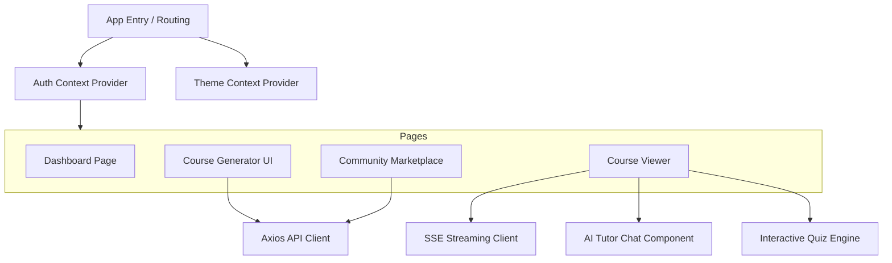

# Frontend Architecture

```mermaid
graph TD
    App[App Entry / Routing] --> AuthContext[Auth Context Provider]
    App --> ThemeContext[Theme Context Provider]
    
    AuthContext --> Pages
    
    subgraph Pages
        Dashboard[Dashboard Page]
        Market[Community Marketplace]
        CourseView[Course Viewer]
        Generator[Course Generator UI]
    end
    
    CourseView --> SSE[SSE Streaming Client]
    CourseView --> Tutor[AI Tutor Chat Component]
    CourseView --> Quiz[Interactive Quiz Engine]
    
    Generator --> ApiClient[Axios API Client]
    Market --> ApiClient
```
