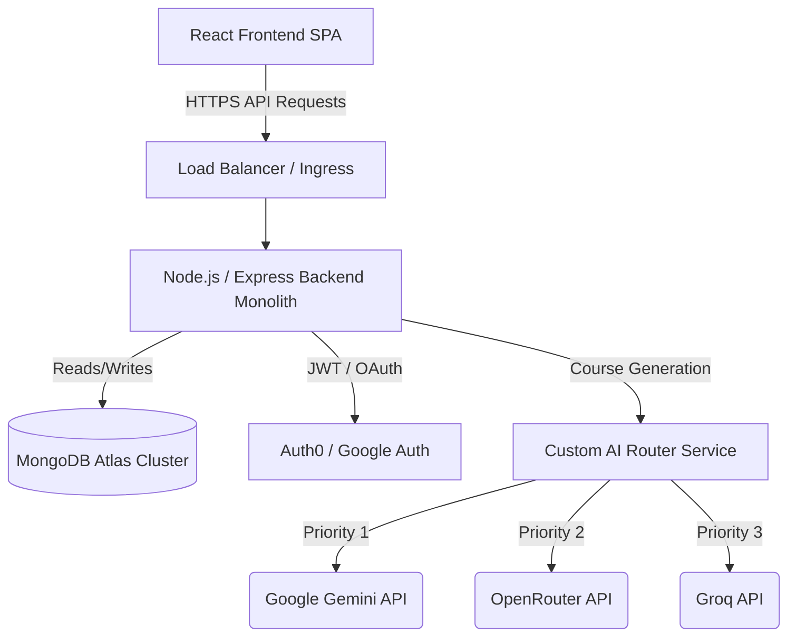

# System Architecture

```mermaid
graph TD
    Client[React Frontend SPA] -->|HTTPS API Requests| LB[Load Balancer / Ingress]
    LB --> NodeAPI[Node.js / Express Backend Monolith]
    
    NodeAPI -->|Reads/Writes| MongoDB[(MongoDB Atlas Cluster)]
    NodeAPI -->|JWT / OAuth| Auth[Auth0 / Google Auth]
    
    NodeAPI -->|Course Generation| AI_Router[Custom AI Router Service]
    
    AI_Router -->|Priority 1| Gemini(Google Gemini API)
    AI_Router -->|Priority 2| OpenRouter(OpenRouter API)
    AI_Router -->|Priority 3| Groq(Groq API)
```
