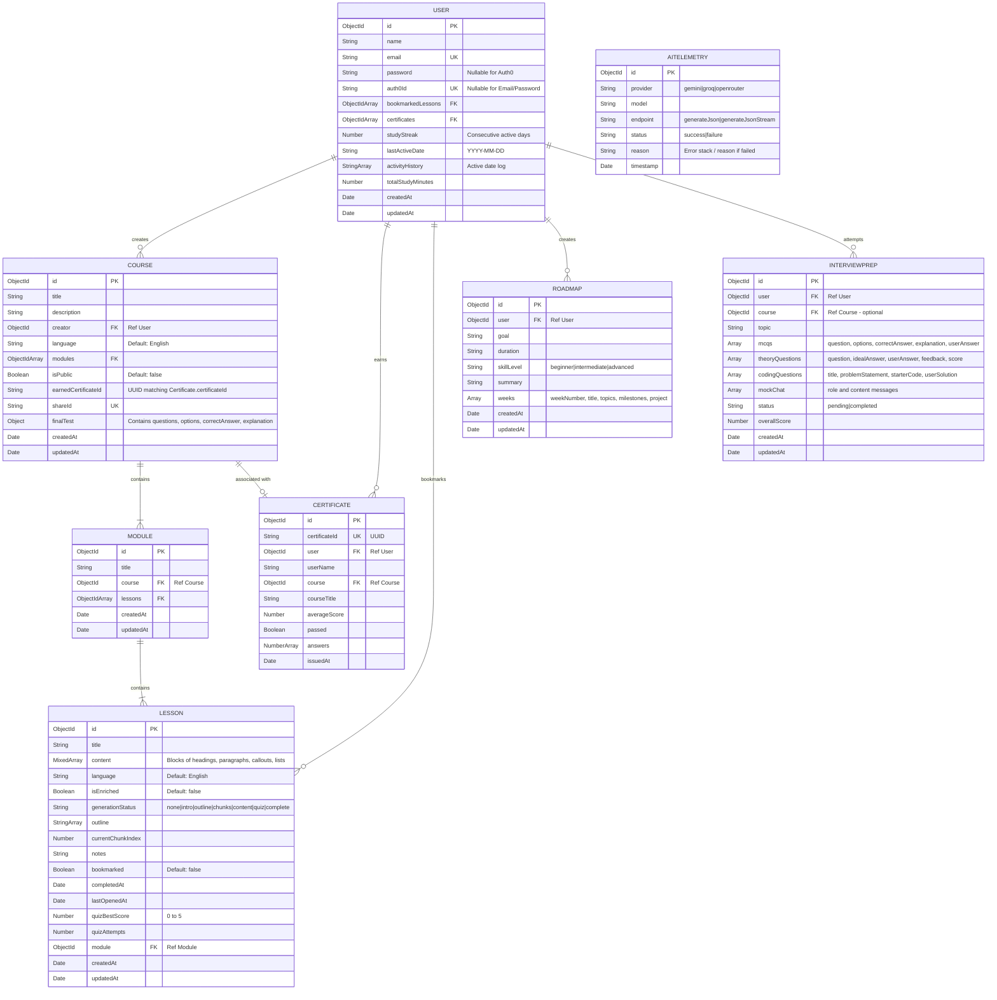

# Database ER Diagram

This document describes the schema architecture of our database layer, matching the models persisted in MongoDB.

## Entity Relationship Model

## Schema Definitions & Indexes

### User Collection
* **Auth0 Support:** `auth0Id` is defined as a unique sparse index (`{ auth0Id: 1 }, { unique: true, sparse: true }`) to allow standard email registrations alongside OAuth connections.
* **Relations:** Maintains arrays of ObjectIds pointing to `bookmarkedLessons` and `certificates`.

### Course Collection
* **Structure:** Encapsulates high-level details, an array of `Module` references, and the dynamically generated `finalTest` nested sub-document structure.
* **Indexes:** `creator` is indexed for fast lookup on the "My Courses" page. `shareId` is set as a unique sparse index for clean URL public course sharing.

### Lesson Collection
* **Dynamic Generation:** Tracks state variables like `generationStatus` and `currentChunkIndex` to support modular, token-efficient stream content loading.
* **Structured Blocks:** The `content` field is a Mixed Array holding blocks with schemas defining paragraph texts, warning callouts, code samples, list components, etc.

### AI Telemetry Collection
* **Telemetry Data:** Captures detailed usage logs of LLM provider execution times and errors.
* **Indexes:** Multi-key indexes on `provider` and `model` + descending indices on `timestamp` for dashboard latency plotting.

### Roadmap Collection
* **Structure:** Stores AI-generated weekly learning plans with topics, milestones, and mini-projects.
* **Relations:** Each roadmap belongs to a single user.

### InterviewPrep Collection
* **Structure:** Stores AI-generated interview preparation packages containing MCQs, theory questions, coding challenges, and mock interview chat history.
* **Scoring:** Maintains per-question user answers and AI-evaluated feedback with an overall composite score.
