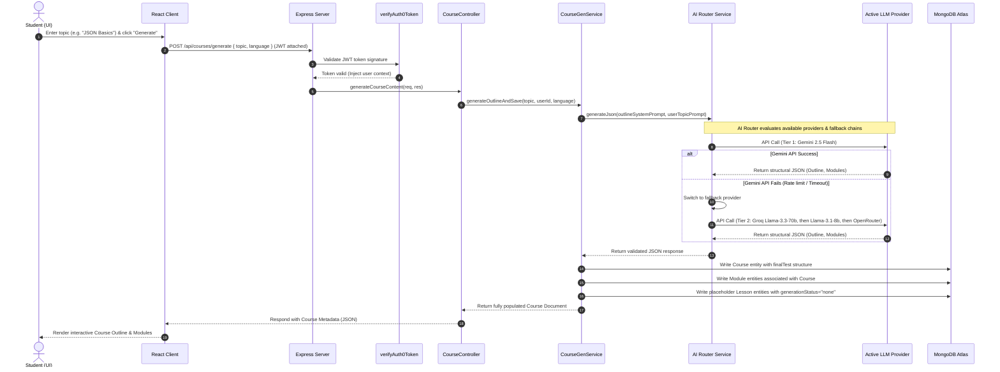

# Sequence Diagram: Course Outline & Chapter Generation

This document maps out the detailed timeline and sequence of operations for generating structured courses and outlines via the AI Router.

## Generation Timeline Sequence

## Detailed Component Roles

1. **Auth Middleware (`verifyAuth0Token`):** Intercepts course requests, parses Bearer tokens, validates signatures against JWKS endpoints, and populates the `req.user` payload.
2. **AI Router Fallback Engine:** Handles rate limits or outages seamlessly. The full chain is Gemini (`gemini-2.5-flash`) → Groq (`llama-3.3-70b-versatile`, then `llama-3.1-8b-instant`) → OpenRouter (`gpt-4o-mini`, then `gpt-4o`). If a tier fails, it automatically shifts to the next and files success/fail logs in telemetry.
3. **Multi-level Entity Creation:** Rather than constructing full course content upfront, the generator first writes the hierarchy structure (`Course` -> `Module` -> `Lesson` stubs). Content streaming is then requested on-demand as the user visits each lesson, protecting backend systems from payload limits.
