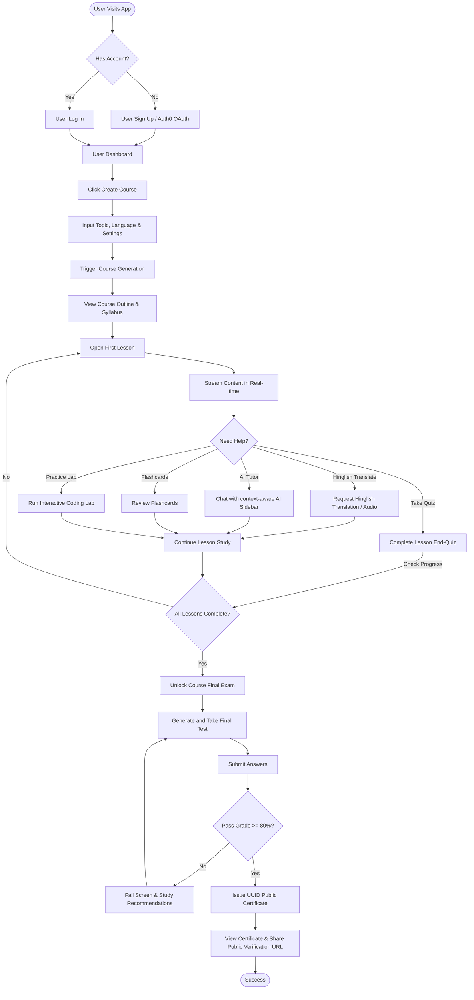

# User Flow Diagram

This document traces the complete user journey through the application, mapping the core user behaviors and pathways.

## End-to-End User Flow

## Detailed Path Milestones

1. **Authentication:** Support for OAuth-based integrations using Auth0 alongside traditional credentials.
2. **Dynamic Generation & Streaming:** Course creation uses chunked generation pipelines to prevent API timeout issues, meaning outlines load instantly, and lesson contents stream dynamically.
3. **Interactive Support Systems:** Lessons feature inline tools (AI chatbot, audio and text translations, practice environments, and flashcard widgets).
4. **Final Assessment & Verification:** Once lesson checkpoints are cleared, users submit answers to a final exam. If they achieve 80%+, a secure UUID public certificate is created and linked to their profile.
